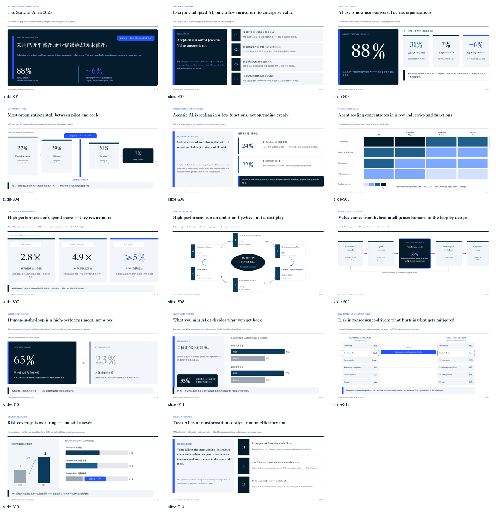
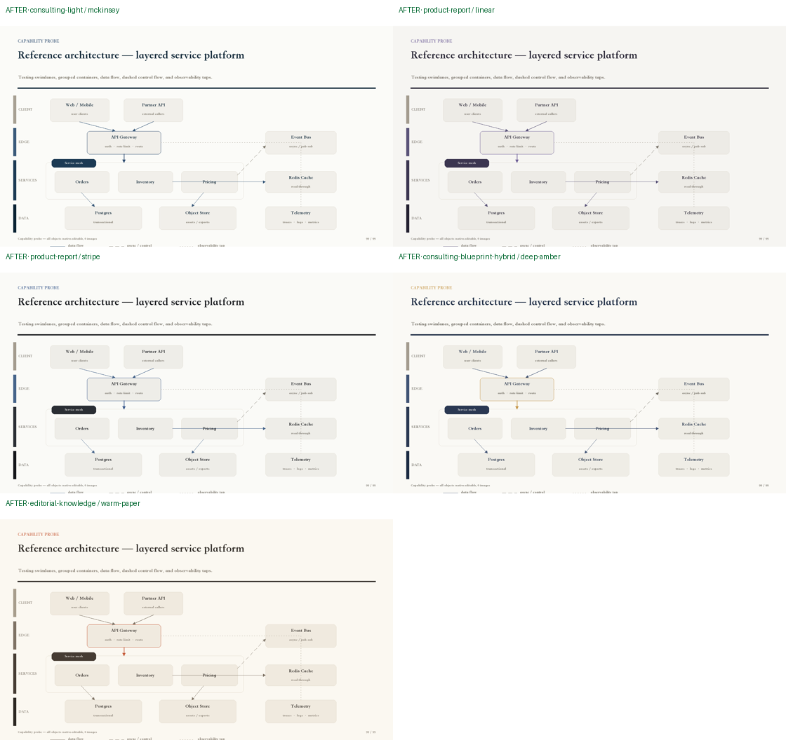
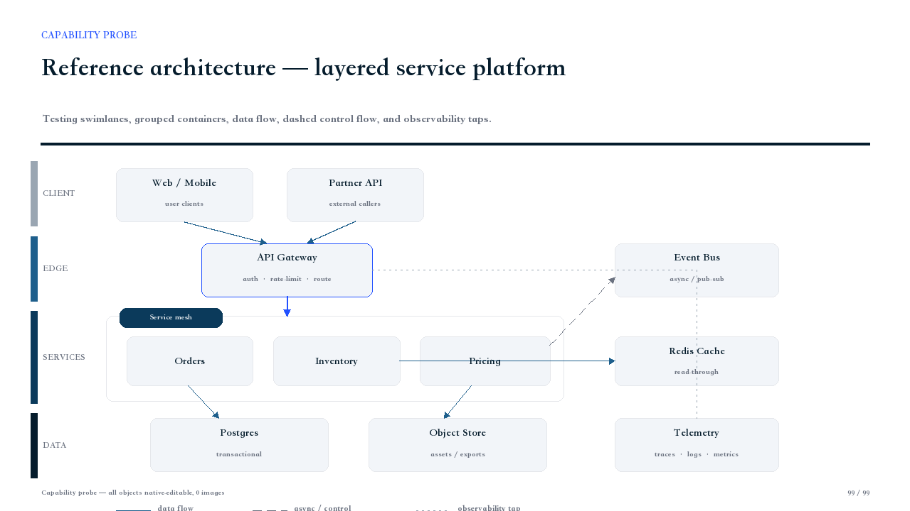

# MeowClawLab

> English version: [README.en.md](./README.en.md)

MeowClawLab 是一个面向 OpenClaw 的实验仓库，用来沉淀实用技能、工作流和运维型 playbook。

当前重点是“可靠优先”的自动化：技能要让普通用户容易使用，同时在真实系统中足够保守，能保护 Gateway 可用性、配置安全、插件、频道、agent 路由和最终交付质量。

## 🔥 当前重点：MeowClaw PPTSmith v2.0.4

[`MeowClaw 夜猫 PPT 工坊 / MeowClaw PPTSmith`](./Skills/article-html-to-ppt/) 已从“文章转模板”升级为一条**低返工、可编辑、可验证**的 PPT 生产链。

**新增核心能力：**

- **内容先于排版：** 内容分析、证据盘点、故事线、判断式标题与表达模式先行。
- **五套基础视觉系统：** 咨询报告、产品汇报、技术蓝图、咨询 × 技术混合、编辑知识型。
- **Style Contract v2：** 锁定颜色、字体、网格、间距、卡片、表格、图表和图解规则，减少模型间视觉漂移。
- **双 Builder + 自动选路：** 支持 `python_pptx` 与 PptxGenJS，并按环境能力选择构建路径。
- **复杂图解与组件路由：** 通过 PPT IR、Diagram IR、组件注册表与 Delivery Plan，兼顾复杂表达和核心信息可编辑性。
- **Fast / Standard / Premium：** 根据草稿、正式汇报或高价值交付自动匹配工件与验证强度。
- **可信 QA：** 能力探测、结构检查、真实渲染、回读、视觉评分与交付清单逐层验证，明确区分 `Created`、`Rendered`、`Read back`、`Verified` 与 `Final`。
- **多出口交付：** 支持本地 PPTX、原生渐进式动态 PPTX、HTML 预览，以及经明确授权后的飞书幻灯片路线。

[查看 PPTSmith 中文说明与快速用法 →](./Skills/article-html-to-ppt/README.md)

> 开源版提供核心引擎、基础风格、通用组件、QA 与可信交付；专业生产包、企业品牌适配、专属页面原型和定制服务保持独立商业交付。


## 真实 PPT 效果展示（保留样例）

以下图片来自此前使用 McKinsey / QuantumBlack 公开报告 *The State of AI in 2025* 进行的 14 页压力测试，用于展示真实生成效果，不是概念占位图：

- **0 张栅格贴图作为正文页**：核心文本、卡片、表格、节点、箭头和关系图均为 PPT 原生对象。
- **302 段可编辑文本**：便于后续在 PowerPoint、Keynote 或 Feishu Slides 中继续修改。
- **复杂关系图增强**：包含曲线箭头、虚线、折线、肘线和双箭头等图元。
- **配色契约升级**：五套基础风格采用低饱和、有色温、克制的配色体系。







## 技能列表

| 技能 | 用途 | 状态 |
| --- | --- | --- |
| [`openclaw-verified-upgrade`](./Skills/openclaw-verified-upgrade/) | 带验证链路的 OpenClaw 安全升级技能：选择目标版本、检查版本风险、创建可验证备份、安全升级，并验证运行中的 Gateway 与关键用户链路。 | 已发布 |
| [`article-html-to-ppt`](./Skills/article-html-to-ppt/) | MeowClaw PPTSmith v2.0.4：把文章、PRD、研究材料和技术方案转成低返工、可编辑、可验证的演示稿，提供五套基础视觉系统、双 Builder、复杂图解路由、分档生产与可信 QA。 | v2.0.4 |

## 设计原则

- **用户入口要简单。** 普通用户只需要表达目标，不应该被迫理解底层命令、平台权限和交付格式细节。
- **内部流程要严格。** 执行前必须做能力检查、风险评估、必要备份、受控执行和结果验证。
- **最新不等于最好。** 对升级类任务，除非用户明确要求 latest，或 latest 修复了当前相关问题，否则优先推荐相对稳定版本。
- **创建成功不等于最终完成。** 对文档、幻灯片、视频、应用等交付物，要区分 `Created`、`Rendered`、`Read back` 和 `Final`。
- **来源边界要清楚。** 外部文章、图片、截图、复原图和引用内容必须保留使用边界，不能把参考材料包装成自有事实。
- **授权边界要清楚。** 安装、更新、覆盖、强制升级、重启、回滚、上传、发布等状态变更都需要明确授权。

## 仓库结构

```text
MeowClawLab/
├── README.md
├── README.en.md
├── README.zh-CN.md
├── LICENSE
└── Skills/
    ├── article-html-to-ppt/
    │   ├── README.md
    │   ├── README.en.md
    │   ├── SKILL.md
    │   ├── skill-card.md
    │   ├── references/
    │   └── templates/
    └── openclaw-verified-upgrade/
        ├── README.md
        ├── README.zh-CN.md
        ├── SKILL.md
        └── test-prompts.json
```

## 如何使用技能

把需要的技能目录复制或安装到 OpenClaw 的 skills 路径中，然后让 agent 在匹配任务时使用该技能。

例如，`openclaw-verified-upgrade` 适合这些请求：

```text
帮我安全升级 OpenClaw。
把 OpenClaw 升级到稳定版本，并确认 Gateway 还能正常工作。
把 OpenClaw 升级到 2026.x.x，升级前备份，失败时要有回滚计划。
```

`article-html-to-ppt` 适合这些请求：

```text
把这篇公众号文章转成飞书幻灯片。
把这份 Markdown 草稿做成正式品牌版 PPT。
先生成演示分镜和 HTML 预览，再导出到幻灯片。
```

## 安全提示

这些技能可能涉及运行中的 OpenClaw Gateway、外部平台、文档上传、幻灯片生成或公开发布。升级、重启、回滚、配置修复、daemon 修改、skill 更新、飞书上传、GitHub 发布等都属于状态变更操作，应在明确授权和验证后执行。
