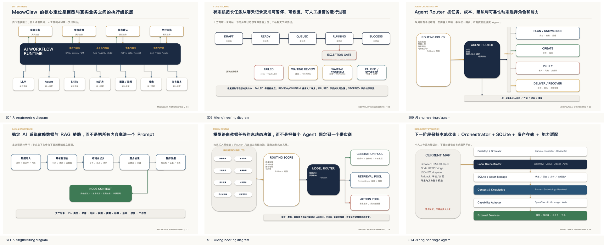
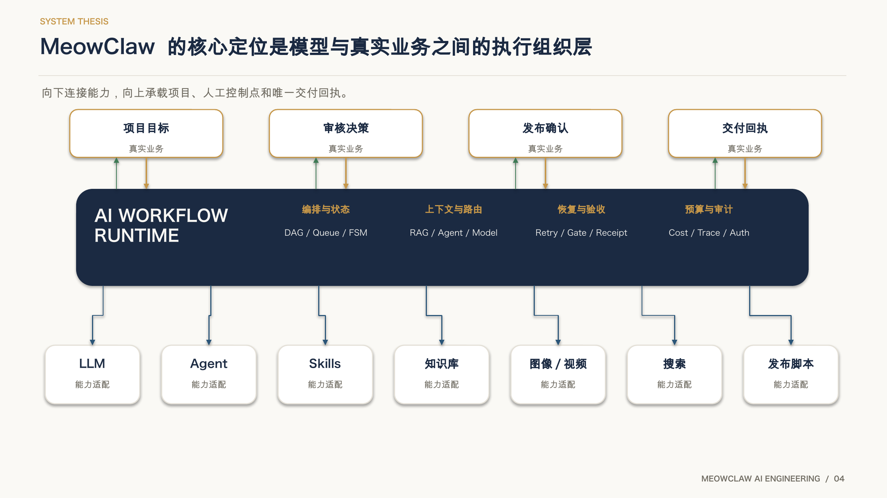
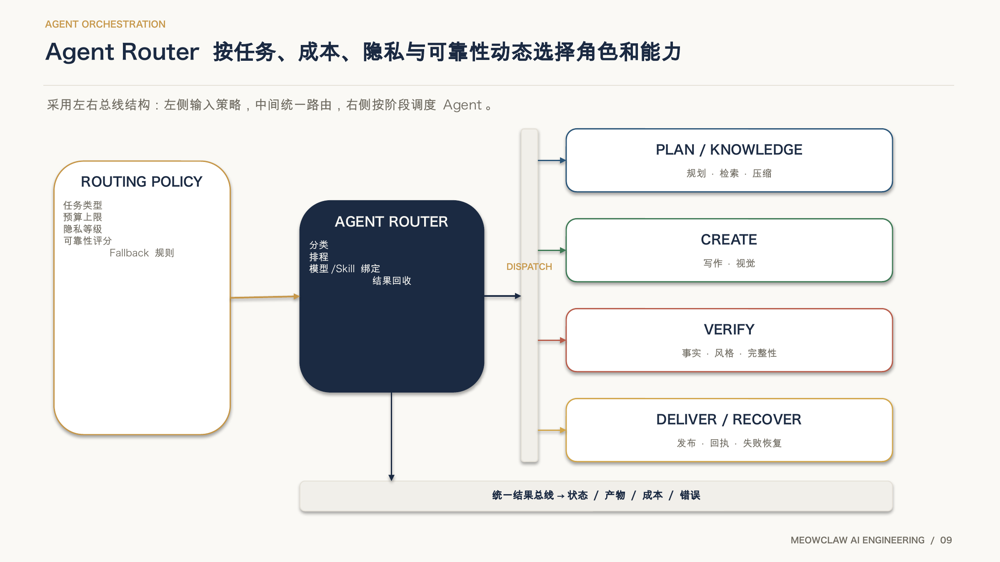
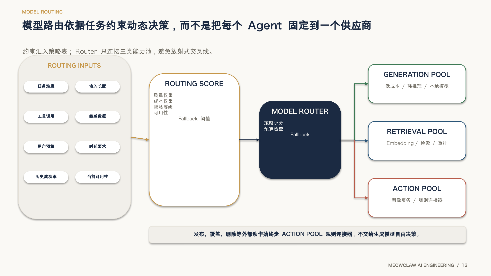

# MeowClaw PPT Smith

> 中文文档（默认）: [README.md](./README.md) · OpenClaw execution contract: [SKILL.md](./SKILL.md)

Convert articles, Markdown drafts, HTML pages, WeChat drafts, PRDs, automation plans, knowledge posts, and review-approved manuscripts into low-rework, persona-fit slide decks.

`MeowClaw PPT Smith` is the public display name introduced in v2.0.6. `MeowClaw PPTSmith` and `MeowClaw 夜猫 PPT 工坊` remain compatibility and search aliases only. The ClawHub slug and installed OpenClaw route remain `article-html-to-ppt` for update continuity.

**v2.0.7 readiness:** this release adds native straight, orthogonal/elbow, and curved connector routing plus diagram-topology gates. QA rejects straight connectors through unrelated nodes or text and ambiguous connector crossings. Complex technical diagrams require enlarged single-slide render review before whole-deck packaging. The v2.0.6 public name and discovery copy remain unchanged. Native Microsoft PowerPoint compatibility remains unverified. See [the v2.0 acceptance report](docs/v2.0-acceptance-report.md).

## Sample Gallery

These samples mirror the repository-home gallery and are copied into the Skill-owned asset directory so they render directly from this page.

### State of AI 2025: complete 14-slide sample


### Unified palette-system upgrade


### Native editable architecture diagram


## v2.0.7 AI Engineering Project Deck

These screenshots come from a real 19-slide AI project deck rendered and reviewed with LibreOffice. They demonstrate the v2.0.7 upgrades for execution layers, state machines, Agent routing, RAG, model routing, and deployment evolution.



### Execution layer: elbow routing across layers

Runtime-to-capability relationships use reserved connector channels instead of diagonal lines through content.



### Agent Router: a dispatch bus instead of a radial connector web

Policy, Router, Dispatch Bus, and Agent Groups are separated so every route remains traceable.



### Model routing: input container, score policy, and capability pools

Constraints enter one explicit container before Routing Score and the three capability pools, keeping the main path and external-action boundary clear.



This skill is designed for article-to-presentation and source-to-deck workflows where the output must be more than a quick template conversion. It helps an agent identify the user persona, derive a storyline, lock content, select a fitting visual baseline, generate editable PPTX files when possible, create native dynamic PPTX decks for presentation mode, upload to Feishu Slides when requested, and report verification status honestly.

This skill supports:

- direct PPTX export
- native dynamic PPTX via progressive build slides
- HTML preview or dynamic HTML companion decks
- Feishu Slides routing
- MeowClawLab visual systems
- persona-fit deck defaults for product owners, agent engineers, and knowledge creators
- consulting-style and editorial knowledge deck baselines
- SVG/HTML preview policy for simple, polished, code-backed layouts
- evidence-backed storyboards
- content lock, slide manifest, and lightweight visual QA gates
- production profiles (`fast`, `standard`, `premium`) with trusted status reporting
- formal PPT IR, Style Contract v2, build, QA, and delivery contracts
- a minimal `python_pptx` runtime builder for native text/table smoke builds

## Quality Contract

- Important claims, numbers, examples, diagrams, and recommendations must trace back to source material or be labeled as reconstruction or assumption.
- Storyline comes before slide production.
- Persona and delivery context come before visual styling.
- Slide content is locked before visual previews or PPTX export.
- Non-trivial decks should maintain `slide_manifest.json`.
- Core text should remain editable where the export format supports it.
- Visual structure should not be downgraded into a flat screenshot unless the user explicitly accepts that tradeoff.
- Platform capability gaps are reported instead of hidden.
- Dynamic PPT requests are answered with native PPTX progressive-build decks unless the user explicitly asks for web-only output.
- A handoff must separate `Created`, `Rendered`, `Read back`, and `Final`.

## Persona Defaults

- Product owners / product reporters: executive summary, decision ask, metrics, roadmap, risks, and next steps.
- Agent engineers / automation developers: workflow, architecture, failure modes, implementation plan, permissions, and ROI.
- Self-media authors / knowledge bloggers: hook, framework, examples, practical steps, reusable social/content cards, and brand rhythm.

## When To Use

Use this skill when you need to:

- Convert long-form writing into a slide deck.
- Turn a WeChat article, Markdown draft, HTML article, PRD, automation proposal, product report, knowledge post, or research synthesis into a presentation.
- Generate a local `.pptx` file that can be opened in PowerPoint, Keynote, LibreOffice Impress, or imported into Google Slides.
- Generate a dynamic PPTX that reveals content step by step during presentation.
- Create or upload a Feishu Slides deck for online collaboration and sharing.
- Preserve source-rights boundaries and attribution.
- Keep a deck professional, readable, persona-fit, and brand-consistent.
- Use SVG or HTML/CSS as a preview/design aid while preserving editable PPT core objects where practical.
- Maintain slide manifests and lightweight QA gates for non-trivial decks.
- Distinguish generated, rendered, read-back, and final delivery states.

## Stage 6 Verification

After building a deck, run the verifier:

```bash
python3 scripts/verify_deck.py deck.pptx \
  --ppt-ir .ppt-work/contracts/ppt-ir.json \
  --style .ppt-work/contracts/style-contract.json \
  --delivery .ppt-work/contracts/delivery-plan.json \
  --build .ppt-work/contracts/build-manifest.json \
  --render \
  --output .ppt-work/qa/qa-report.json
```

Exit codes are `0` pass, `1` verification failure, `2` renderer unavailable,
`3` bad input, and `4` internal error. This repository does not fabricate render
evidence: if PowerPoint/Keynote/LibreOffice is unavailable, the report records
`RENDER_ENGINE_UNAVAILABLE` and caps the build status.

For repair loops:

```bash
python3 scripts/repair_deck.py deck.pptx \
  --qa-report .ppt-work/qa/qa-report.json \
  --output-pptx .ppt-work/qa/repaired.pptx \
  --output-report .ppt-work/qa/repair-report.json
```

Only registered safe deterministic repairs may run. Visual/render defects remain
manual until a real renderer can recheck them.

## Privacy And Cloud Export Notice

Local PPTX export is the safer default for sensitive drafts, PRDs, internal metrics, automation designs, and unpublished content. Feishu/Lark Slides export sends source content, generated slide text, and relevant metadata to the Feishu/Lark cloud environment. Only use Feishu/Lark upload or sharing when the user explicitly asks for cloud delivery and the content is appropriate for that service. Before uploading, summarize what will be transmitted and confirm the intended destination or sharing boundary.

## How To Use

Give the agent the source material, audience/persona, and desired export target:

```text
Use MeowClaw PPTSmith to turn this PRD and metrics summary into an editable PPTX.
Compatible route: article-html-to-ppt.
Audience: product leadership
Persona: product owner / product reporter
Goal: secure roadmap approval
Style: clean product review, consulting-style, low rework
Slides: around 8-12
```

For Agent engineering or automation decks:

```text
Use MeowClaw PPTSmith to create a technical review PPT.
Compatible route: article-html-to-ppt.
Persona: Agent engineer / automation developer
Include: workflow diagram, architecture, failure modes, implementation plan, ROI.
Use SVG for simple architecture or state-machine diagrams if helpful.
```

For knowledge creators:

```text
Use MeowClaw PPTSmith to turn this article into a knowledge deck.
Compatible route: article-html-to-ppt.
Persona: self-media author / knowledge blogger
Include: hook, framework, examples, practical steps, and reusable social-card slides.
```

For native dynamic PPTX:

```text
Use MeowClaw PPTSmith to create a dynamic PPTX.
Compatible route: article-html-to-ppt.
The exported PPT should reveal bullets step by step during presentation.
Also include speaker notes and a verification report.
```

For Feishu Slides:

```text
Use MeowClaw PPTSmith to turn this article into Feishu Slides
and send me the shareable Feishu Slides link.
```

## Export Behavior

The skill chooses the export route from the user's wording, persona, delivery context, and available capabilities.

### Generates a PPTX file

The skill should generate a local PPTX file when the user asks for:

- `PPT`, `PPTX`, `PowerPoint`, `Keynote`, or an editable deck file
- direct export
- a file that can be sent, archived, opened locally, or imported elsewhere
- dynamic PPT / animated PPT that must work in presentation mode
- both a local deck and a cloud upload

Typical outputs:

- `deck.pptx` for a static editable deck
- `deck-dynamic-native.pptx` for a native dynamic deck
- `pptx-build-report.json` or `native-dynamic-pptx-report.json`
- `verification-report.md`

### Uses SVG or HTML/CSS when useful

SVG and HTML/CSS are design aids, not excuses to flatten the whole deck:

- Use native PPT objects for standard text, shapes, tables, diagrams, and simple charts.
- Use SVG for simple, scalable effects: issue trees, icons, line diagrams, badges, dividers, simple architecture maps, and state machines.
- Use HTML/CSS as a preview surface for layout, typography, tables, dashboards, longform editorial pages, or dense technical diagrams before rebuilding/exporting to PPTX.
- Do not use HTML screenshots as the final deck unless the user accepts low editability.

### Generates a native dynamic PPTX

When the user asks for dynamic PPT, the default is **native dynamic PPTX**, not HTML.

The stable implementation is progressive-build slides:

- one logical slide may become multiple physical PPTX slides
- each physical slide reveals the next bullet, diagram part, or emphasis
- PowerPoint/Keynote presentation mode advances through these build steps
- optional native fade transitions make the reveal feel smoother

The handoff should report both:

- logical slide count
- native build-step slide count

### Uploads or creates Feishu Slides

The skill should create or upload to Feishu Slides when the user asks for:

- `Feishu Slides`, `飞书幻灯片`, `Lark Slides`, or an online slide deck
- a shareable cloud link
- collaborative editing in Feishu
- direct upload to a specific Feishu location
- final delivery as a Feishu document rather than a local file

Feishu delivery depends on the current environment's Feishu/Lark authorization and API capability. Creation/upload is not the same as final verification: when possible, the agent should read back or screenshot the Feishu Slides result before calling it final.

Before Feishu/Lark export, confirm that the user intended cloud delivery. Do not silently upload sensitive drafts, internal PRDs, metrics, automation designs, or unpublished content.

## Files

- `SKILL.md` - the actual OpenClaw skill document.
- `skill-card.md` - public-facing skill card metadata.
- `README.md` - public documentation entry for `MeowClaw 夜猫 PPT 工坊` / `MeowClaw PPTSmith`, while preserving the `article-html-to-ppt` compatibility route.
- `docs/migration-v1.1-to-v1.2.md` - migration guide for older manifests and templates.
- `docs/v1.5-v2.0-closeout-checklist.md` - completed closeout criteria and remaining Premium external acceptance item.
- `docs/v2.0-acceptance-report.md` - canonical Standard acceptance verdict, evidence, provenance, and limitations.
- `references/export-pipelines.md` - export routing for PPTX, dynamic PPTX, Feishu Slides, and HTML.
- `references/visual-design-archetypes.md` - visual direction archetypes.
- `references/visual-systems.md` - reusable visual system constraints.
- `templates/storyboard-template.md` - storyboard and verification template.
- `templates/content-lock-template.md` - content lock template.
- `templates/slide-manifest-template.json` - slide manifest template.
- `templates/visual-qa-gate-template.json` - visual QA gate template.

## Templates

- `templates/storyboard-template.md`
- `templates/content-lock-template.md`
- `templates/slide-manifest-template.json`
- `templates/visual-qa-gate-template.json`

## Version

2.0.4

The version claim distinguishes three scopes: Standard production readiness on the verified environment; Premium final acceptance on the recorded LibreOffice route; and native Microsoft PowerPoint compatibility, which has not been verified.

## Publishing Note

This skill is intended to be reusable and GitHub-friendly. It should not contain local secrets, user-specific credentials, private paths, raw chat logs, or platform tokens.
