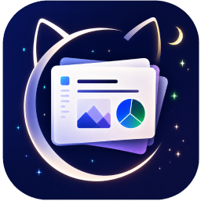

# MeowClaw PPT Smith

<p align="center">
  
</p>

> English documentation: [README.en.md](./README.en.md) · OpenClaw 执行规范：[SKILL.md](./SKILL.md)

把文章、Markdown、HTML、公众号草稿、PRD、研究材料与设计说明，转成**低返工、可编辑、可验证**的专业演示文稿。

- **公开品牌：** MeowClaw PPT Smith
- **兼容安装名：** `article-html-to-ppt`
- **兼容搜索词：** MeowClaw PPTSmith、MeowClaw 夜猫 PPT 工坊
- **当前版本：** `2.0.7`（连接器路由与图拓扑质量门禁）
- **开源定位：** 核心引擎、基础五风格、通用组件、可编辑对象、QA 与可信交付

> PPTSmith 的 GitHub / ClawHub 开源版用于分发、获客与建立可信度。专业生产包、企业品牌适配、专属页面原型、定制组件和代生成/部署服务采用独立商业交付，不包含在本仓库与 ClawHub 包中。

## v2.0 一眼看懂

PPTSmith v2.0 不只是“把文字塞进模板”，而是一条从内容判断到可信交付的完整生产链：

1. **先理解内容，再画页面**：内容分析、证据盘点、故事线、判断式标题与表达模式先行。
2. **五套基础视觉系统**：咨询报告、产品汇报、技术蓝图、咨询 × 技术混合、编辑知识型。
3. **Style Contract v2**：颜色、字体、网格、间距、卡片、表格、图表、图解等设计参数可锁定、可校验，减少不同模型随意漂移。
4. **双 Builder 与自动选路**：支持 `python_pptx` 与 PptxGenJS，根据环境能力选择合适构建路径。
5. **复杂图解不再硬画**：通过 PPT IR、Diagram IR、组件注册表和 Delivery Plan，为表格、图表、流程、架构与关系图选择原生、SVG 或混合交付路线。
6. **核心信息保持可编辑**：标题、正文、卡片、表格、简单图表与关键标签优先保留为 PowerPoint 原生对象。
7. **Fast / Standard / Premium 三档生产配置**：按用途决定所需工件和验证强度，避免草稿流程过重，也避免正式交付缺证据。
8. **端到端 QA 与可信状态**：能力探测、构建清单、结构检查、真实渲染、回读、视觉评分、交付清单逐层验证；明确区分 `Created`、`Rendered`、`Read back`、`Verified` 与 `Final`。
9. **失败时诚实收口**：没有真实渲染器、证据绑定或评分不达标时，不伪造截图、不手写 `final`，而是明确降级或阻断。
10. **多种交付出口**：本地 PPTX、原生渐进式动态 PPTX、HTML 预览，以及经用户明确授权后的飞书幻灯片路线。

### 2.0.7 连接器路由与图拓扑门禁

- 同轴相邻节点使用直线，跨行流程与总线使用原生肘形折线，反馈与恢复路径使用原生曲线。
- 多对一和一对多关系改用总线与短支线，禁止中心节点放射成不可读线团。
- QA 阻断连接器穿越无关节点或文字、主连接线交叉、悬空箭头和缺少层间路由通道。
- 复杂技术图必须先做单页放大渲染验收，再进入整套构建与联系表检查。
- 保留 2.0.6 的公开名称 **MeowClaw PPT Smith** 与 SEO/兼容别名，不回退旧展示名。

### 2.0.5 质量安全修复

- 简单流程图使用**单一带箭头连接器对象**，箭头不再由独立三角形或 chevron 色块模拟。
- `python_pptx` 流程连接器绑定两端形状连接点；移动节点时关系随之更新。
- Standard 能力按组件判定：复杂架构、层级、矩阵、飞轮、生态图与商业阶梯没有合格实现时直接阻断，不降级成文字框。
- QA 阻断未声明的空白实色色块，避免残留箭头头部、意外覆盖层和偶发多余色块。
- 文件可打开、文字可编辑、无越界、非空白只是结构条件，不再视为专业视觉质量证明。

## 样例图库

以下样例与仓库首页保持一致，并复制到 Skill 自有资产目录，确保从当前页面浏览时可直接查看。

### State of AI 2025：14 页完整演示样例


### 统一配色系统升级


### 原生可编辑技术架构图


## 2.0.7 AI 工程项目汇报样例

这组样例来自真实生成并通过 LibreOffice 渲染验收的 19 页 AI 项目汇报。重点展示 2.0.7 对执行组织层、状态机、Agent Router、RAG、模型路由和部署演进的升级。


### 执行组织层：跨层关系使用肘形折线

Runtime 与能力节点使用专用连接通道，避免斜直线穿越内容。


### Agent Router：总线代替放射式线团

Policy、Router、Dispatch Bus 与 Agent Group 分区表达，输出路径可逐条追踪。


### 模型路由：输入容器、策略评分与能力池

约束条件先汇入输入容器，再进入 Routing Score 和三类能力池；主路径与外部动作边界清晰。


## 适合谁

- **产品负责人 / 汇报人：** 决策摘要、指标、路线图、风险与下一步。
- **Agent 工程师 / 自动化开发者：** 工作流、架构、权限、失败模式、实施计划与 ROI。
- **自媒体作者 / 知识创作者：** 钩子、框架、案例、步骤、知识卡片与品牌节奏。
- **咨询、研究与业务团队：** 把长文、报告和证据整理成结构清晰、可追溯的正式 deck。

## 输入与输出

**常见输入**

- 文章、Markdown、HTML、微信公众号草稿
- PRD、产品方案、复盘、路线图
- 技术架构、自动化方案、Agent 工作流
- 研究材料、知识笔记、审稿通过的长文

**常见输出**

- `deck.pptx`：静态、可编辑 PPTX
- `deck-dynamic-native.pptx`：原生渐进式动态 PPTX
- `deck-preview.pdf`：在可用渲染环境下生成的预览
- `verification-report.md`：验证与限制说明
- `delivery-manifest.json`：可信交付状态与产物清单

## 快速使用

把材料、受众、目标和交付格式告诉 Agent：

```text
使用 MeowClaw PPTSmith（兼容路由 article-html-to-ppt）把这份 PRD 做成 10 页左右的可编辑 PPTX。
受众：产品管理层
目标：争取路线图审批
风格：产品汇报，克制、清晰、低返工
必须包含：关键判断、指标、路线图、风险和下一步
```

技术汇报示例：

```text
使用 MeowClaw PPTSmith 制作技术评审 PPT。
受众：Agent 工程师与业务负责人
包含：工作流、系统架构、权限边界、失败模式、实施计划和 ROI。
核心文字、表格和简单图表保持可编辑。
```

## 生产链

```text
源材料 / 文章 / 设计说明
→ 内容分析与证据盘点
→ 故事线与判断式标题
→ PPT IR / Diagram IR
→ Style Contract v2
→ 能力探测与 Builder 选择
→ 组件交付路线解析
→ 可编辑 / 混合式 PPT 构建
→ 结构检查与真实渲染回读
→ 视觉评分与修订
→ 交付打包与 Delivery Manifest
```

## 五套基础视觉系统

| 风格 | 适用场景 | 默认特征 |
| --- | --- | --- |
| `consulting-light` | 管理层汇报、研究与咨询报告 | 结论先行、留白克制、证据清晰 |
| `product-report` | PRD、路线图、发布与复盘 | 指标、权衡、计划与产品节奏 |
| `technical-blueprint` | 架构、工作流、实施与运维 | 精确边界、节点、链路和故障模式 |
| `consulting-blueprint-hybrid` | Agent / 自动化的业务技术汇报 | 咨询结构为主，技术图解为证据层 |
| `editorial-knowledge` | 长文、课程、知识产品与个人 IP | 温暖纸张感、框架化、便于传播 |

这些是公开基础系统。企业品牌模板、专属母版、行业生产包和定制组件不随开源包发布。

## 可信交付边界

PPTSmith 不把“文件生成成功”等同于“最终完成”：

- **Created**：PPTX 已生成。
- **Rendered**：真实办公套件或渲染器已完成渲染。
- **Read back**：结构与渲染结果已回读检查。
- **Verified**：合同、结构、QA 与证据通过验证。
- **Final**：满足对应生产档位的全部可信门槛。

v2.0 已完成 Standard 生产验收；另有一条记录明确的 PptxGenJS 4.0.1 + LibreOffice 26.2.4.2 Premium 验收路线，实现 9/9 页渲染回读、零错误 QA 与绑定证据的 15/18 视觉评分。该结论**不等于**已验证所有 Microsoft PowerPoint / Keynote 版本的像素级一致性。详情见 [v2.0 验收报告](docs/v2.0-acceptance-report.md)。

## 隐私与云端导出

敏感草稿、内部 PRD、业务指标和未公开材料默认优先本地生成 PPTX。只有用户明确要求并确认目标位置与分享边界后，才进入飞书 / Lark 云端创建或上传流程。

## 文档入口

- [OpenClaw 执行规范](./SKILL.md)
- [英文 README](./README.en.md)
- [v2.0 验收报告](docs/v2.0-acceptance-report.md)
- [v1.5 → v2.0 收口清单](docs/v1.5-v2.0-closeout-checklist.md)
- [生产配置说明](references/production-profiles.md)
- [五套视觉系统](references/five-style-master-systems.md)
- [组件交付与 Builder 适配](references/builder-adapters.md)
- [验证体系](references/verification-harness.md)

## 开源与商业化边界

本仓库与 ClawHub 包持续开放可复用的 PPTSmith 核心能力，让个人与团队能独立生成、检查并交付可靠的演示文稿。

以下内容保持独立商业交付：

- 专业生产包与行业化工作流
- 企业品牌适配、专属母版与视觉资产
- 专属页面原型与定制组件
- 代生成、部署、培训、维护与私有化服务

这样既不削弱开源版的真实可用性，也避免把高价值商业资产混入 MIT-0 公共分发包。
